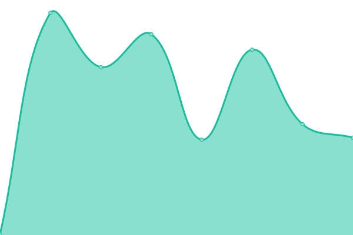
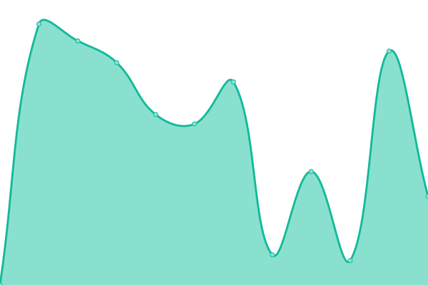

# [📈 Live Status](https://govtechschool.de): <!--live status--> **🟩 All systems operational**

This repository contains the open-source uptime monitor and status page for [Vladislav](https://govtechschool.de), powered by [Upptime](https://github.com/upptime/upptime).

With [Upptime](https://upptime.js.org), you can get your own unlimited and free uptime monitor and status page, powered entirely by a GitHub repository. We use [Issues](https://github.com/VladislavNahaba/upptime/issues) as incident reports, [Actions](https://github.com/VladislavNahaba/upptime/actions) as uptime monitors, and [Pages](https://govtechschool.de) for the status page.

<!--start: status pages-->
<!-- This summary is generated by Upptime (https://github.com/upptime/upptime) -->
<!-- Do not edit this manually, your changes will be overwritten -->
<!-- prettier-ignore -->
| URL | Status | History | Response Time | Uptime |
| --- | ------ | ------- | ------------- | ------ |
|  [Campus](https://campus.govtechschool.de) | 🟩 Up | [campus.yml](https://github.com/themis-digital/upptime/commits/HEAD/history/campus.yml) | 

 277ms
     
 | 

<a href="https://themis-digital.github.io/upptime/history/campus">100.00%</a>
    

|  [Studio](https://studio.govtechschool.de) | 🟩 Up | [studio.yml](https://github.com/themis-digital/upptime/commits/HEAD/history/studio.yml) | 

 216ms
     
 | 

<a href="https://themis-digital.github.io/upptime/history/studio">100.00%</a>
    

|  [Backend](https://backend.govtechschool.de/admin) | 🟩 Up | [backend.yml](https://github.com/themis-digital/upptime/commits/HEAD/history/backend.yml) | 

 1141ms
     
 | 

<a href="https://themis-digital.github.io/upptime/history/backend">100.00%</a>
    

<!--end: status pages-->

[**Visit our status website →**](https://govtechschool.de)

## 📄 License

- Powered by: [Upptime](https://github.com/upptime/upptime)
- Code: [MIT](./LICENSE) © [Vladislav](https://govtechschool.de)
- Data in the `./history` directory: [Open Database License](https://opendatacommons.org/licenses/odbl/1-0/)
